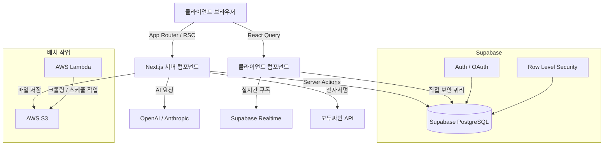
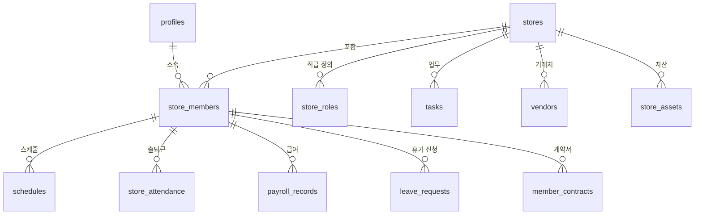

# ShopWork AI 🏪

> **자영업자를 위한 올인원 매장 운영 플랫폼 — 노무·인사·자산·AI 인사이트를 단일 SaaS로 통합**

[](https://nextjs.org/)
[](https://reactjs.org/)
[](https://www.typescriptlang.org/)
[](https://supabase.com/)
[](https://tailwindcss.com/)
[](https://leaven-lake.vercel.app/)

🔗 **라이브 데모:** https://leaven-v2.vercel.app/
> 레포지토리명(`Leaven_v2`)은 서비스명 변경 이전의 개발 초기 명칭입니다.

---

## 목차

1. [프로젝트 개요 & 동기](#1-프로젝트-개요--동기)
2. [기술 스택](#2-기술-스택)
3. [주요 기능](#3-주요-기능)
4. [아키텍처 & 설계 결정](#4-아키텍처--설계-결정)
5. [설치 & 실행 방법](#5-설치--실행-방법)
6. [트러블슈팅 & 회고](#6-트러블슈팅--회고)

---

## 1. 프로젝트 개요 & 동기

### 해결하려는 문제

카페·베이커리·편의점 등 소규모 매장(SMB) 점주들은 다음과 같은 심각한 **도구 파편화** 문제를 겪고 있습니다.

| 업무 | 기존 방식 |
|---|---|
| 직원 스케줄 관리 | 카카오톡 단체채팅 / 엑셀 |
| 출퇴근 기록 | 수기 장부 / 별도 앱 |
| 근로계약서 작성 | 수동 작성 후 출력·사인 |
| 급여 계산 | 엑셀 수식 (주휴수당 누락 위험) |
| 자산·거래처 관리 | 메모 / 별도 스프레드시트 |

매달 최소 3~4개의 앱을 오가며 소요되는 리소스, 그리고 주휴수당·휴게시간 등 복잡한 노동법 미준수로 인한 과태료 리스크가 핵심 페인포인트입니다.

### 솔루션 및 차별점

**ShopWork AI**는 파편화된 노무·회계·운영 업무를 **단 하나의 플랫폼**으로 통합한 자영업자 전용 미니 ERP입니다.

기존 근태 관리 솔루션들과 달리, **LiteLLM 기반 AI 매니저**를 핵심 기능으로 결합합니다. 누적된 스케줄·근태·인수인계 데이터를 AI가 분석하여 점주에게 주간 운영 리포트와 스케줄 추천을 제공함으로써, 단순 기록 도구를 넘어 **의사결정 지원 시스템**으로 포지셔닝합니다.

> 현재 실제 카페(포틀리에)에서 베타 테스트 중이며, Phase 4 기준 핵심 기능(출퇴근·스케줄·전자계약·인수인계·자산관리) 구현 완료.

---

## 2. 기술 스택

| 분류 | 기술 (실제 버전) | 선택 이유 |
|---|---|---|
| **Frontend** | Next.js 16.1.6 (App Router) | RSC 기반 초기 렌더링 최적화, SEO 확보, Server Actions으로 API 라우트 최소화 |
| **Language** | TypeScript 5.x | 급여 계산·권한 로직 등 복잡한 비즈니스 로직의 런타임 에러 원천 방지 |
| **서버 상태** | TanStack React Query 5.x | 대시보드 데이터 갱신, 낙관적 업데이트(Optimistic Update), 세밀한 캐싱 전략 |
| **Styling/UI** | Tailwind CSS v4, shadcn/ui, Radix UI | 일관된 디자인 시스템 구축, 빠른 반복 개발 속도 |
| **폼 검증** | React Hook Form 7.x + Zod 4.x | 복잡한 직원 등록·급여 설정 폼의 유효성 검증을 타입 안전하게 처리 |
| **Backend/DB** | Supabase 2.x (PostgreSQL + Auth) | RLS 기반 멀티테넌시 격리, Auth 통합, SSR 환경 지원(`@supabase/ssr`) |
| **인터랙션** | dnd-kit 6.x, FullCalendar 6.x | 업무 체크리스트 항목의 드래그 앤 드롭 순서 변경, 일간/월간 캘린더 기반 스케줄링 UX |
| **날짜 처리** | date-fns 4.x, date-fns-tz | 주휴수당·휴게시간 계산 등 복잡한 날짜 연산 및 타임존 처리 |
| **AI** | LiteLLM + OpenAI SDK 6.x (호환 클라이언트) | LiteLLM을 통해 `gemini/gemini-2.5-flash-preview` 모델 호출. OpenAI 호환 인터페이스로 모델 교체 없이 프로바이더 전환 가능한 구조 |
| **알림 UX** | Sonner (토스트) | 비동기 작업 결과(승인/반려, 저장 완료 등)의 논블로킹 피드백 |
| **전자계약** | 모두싸인 API | 고용형태별 근로계약서 자동 생성 → 카카오톡/이메일 발송 → 서명 자동화 |
| **결제** | Toss Payments / Stripe | 국내(토스) + 글로벌(Stripe) 동시 대응하는 확장형 결제 구조 |
| **인프라** | Vercel, AWS Lambda, AWS S3 | 웹 배포(Vercel), 배치 작업(Lambda 서버리스), 파일 저장(S3) |
| **알림** | 카카오 알림톡 | 계약서 발송, 보증 만료, 계약 갱신 등 운영 알림 (구현 예정) |

---

## 3. 주요 기능

> ✅ 구현 완료 / 🚧 개발 중 / 📋 기획 확정

### ✅ 전자 근로계약서 자동화

모두싸인 API 연동으로 계약서 작성부터 교부까지 자동화.

1. 직원 등록 시 고용형태(정규직/계약직/알바) 선택
2. 입력된 시급·근무일·계약기간을 계약서에 자동 맵핑
3. 직원 카카오톡/이메일로 즉시 발송
4. 서명 완료 시 Timestamp + IP 로깅 후 PDF 저장


### ✅ 드래그 앤 드롭 스케줄 관리

FullCalendar 기반으로 구글 캘린더 수준의 스케줄 UX 구현. 매장 운영 시간 범위만 표시하는 뷰 필터 포함.


### ✅ 출퇴근 & 휴가 결재

직원 출퇴근 기록 및 수정 요청 결재 플로우, 연차 잔여일 관리 및 휴가 신청 승인/반려 시스템.

### ✅ 업무 관리 & 인수인계

dnd-kit 기반 드래그 앤 드롭으로 업무 체크리스트 순서를 직접 조정할 수 있는 목록형 업무 관리. 교대 인수인계 리포트를 AI가 요약하여 다음 근무자에게 전달.


### ✅ 비품·자산 & 거래처 관리

포스기·냉장고 등 자산의 시리얼·AS 정보·점검 이력 관리. 거래처 대금 상태(미납/완료) 및 세금계산서 내역 관리.

### 🚧 스케줄 기반 급여 자동 정산

근무 기록 기반 자동 급여 계산 (주휴수당·연장·야간 가산 포함). 급여명세서 발급 기능 개발 중.

### 🚧 AI 매니저

| 기능 | 설명 |
|---|---|
| 스케줄 자동 추천 | 과거 패턴 기반 다음 주 근무표 초안 생성 |
| 인수인계 자동 요약 | 교대 기록을 AI가 요약하여 다음 근무자에게 전달 |
| 일간/주간/월간 운영 리포트 | 근무 현황·비용·특이사항 자동 리포트 생성 |
| 만료 알림 | 비품 보증·거래처·근로계약 만료 D-30/D-7 알림 (카카오 알림톡 연동 예정) |

### 📋 구독 결제 (Phase 6 예정)

Toss Payments / Stripe 기반 요금제 운영.

---

## 4. 아키텍처 & 설계 결정

### 전체 구조



### DB 도메인 구조



### 핵심 설계 결정

**① Supabase RLS를 통한 DB 레벨 멀티테넌시**

애플리케이션 레이어(Next.js)에서 권한을 검증하는 대신, PostgreSQL의 Row Level Security 정책으로 DB 레벨에서 타 매장 데이터 접근을 원천 차단했습니다.

- 장점: 보안 누수 위험 최소화, 클라이언트에서 Supabase를 직접 쿼리해도 안전
- 트레이드오프: 초기 RLS 정책 설계가 복잡하고, 자기 참조 테이블에서 무한 루프 에러가 발생할 수 있어 `Security Definer` RPC와 Custom Claims로 보완 필요

**② FSD(Feature-Sliced Design) 아키텍처**

`src/features/` 하위에 도메인(attendance, payroll, tasks, schedules 등)별로 컴포넌트·훅·타입을 응집시켰습니다. 기능이 방대해질수록 파일이 뒤섞이는 문제를 방지하고 유지보수성을 확보하기 위함입니다.

**③ React Query 캐싱 전략 분리**

초기에는 대시보드의 모든 쿼리를 단일 `useQuery`로 묶었으나, 데이터 변경 빈도에 따라 두 그룹으로 분리했습니다.

```
staticQuery  — 자산, 거래처, 유저 정보  → staleTime: 10분, refetchOnWindowFocus: false
liveQuery    — 출퇴근, 스케줄, 공지     → staleTime: 1분, refetchInterval: 5분
```

---

## 5. 설치 & 실행 방법

**필수 환경**
- Node.js 20.x 이상
- npm 또는 pnpm

```bash
# 1. 저장소 클론
git clone https://github.com/JJU09/Leaven_v2.git
cd Leaven_v2

# 2. 패키지 설치
npm install

# 3. 환경변수 설정
cp .env.example .env.local
```

`.env.local` 설정 항목:

```env
# Supabase
NEXT_PUBLIC_SUPABASE_URL=your_supabase_project_url
NEXT_PUBLIC_SUPABASE_ANON_KEY=your_supabase_anon_key

# AI (LiteLLM)
LITELLM_BASE_URL=your_litellm_base_url
LITELLM_API_KEY=your_litellm_api_key

# 전자계약
MODUSIGN_API_KEY=your_modusign_api_key

# 결제
TOSS_CLIENT_KEY=your_toss_client_key
TOSS_SECRET_KEY=your_toss_secret_key
```

```bash
# 개발 서버 실행 (http://localhost:3000)
npm run dev

# 프로덕션 빌드
npm run build && npm start
```

---

## 6. 트러블슈팅 & 회고

### 트러블슈팅

#### 1. 소셜 로그인 시 직원 이름 미표기 오류 (2026-04-27)

**문제:** 특정 모달에서 직원 이름이 "이름 없음"으로 표시됨.

**원인:** v1의 `profiles` 테이블과 v2의 `store_members` 테이블을 혼용하면서 소셜 로그인 정보의 UPSERT가 누락됨.

**해결:** v2 스키마 정리 후 대시보드 전체를 `store_members` 테이블 단일 소스로 고정. 데이터 소스를 하나로 통일하는 것이 스키마 마이그레이션보다 훨씬 중요하다는 것을 체감.

---

#### 2. Vercel 배포 초기 접속 수 초 지연 (2026-04-28)

**문제:** 첫 방문 또는 일정 시간 후 재방문 시 응답 속도가 수 초 이상 지연되다가, 이후 페이지 이동부터는 정상화.

**원인:** `middleware.ts`가 모든 경로에서 매 요청마다 Supabase DB로 프로필 정보를 조회하여 네트워크 오버헤드 유발.

**해결:**
- 미들웨어를 단순 세션 확인만 담당하도록 경량화
- 프로필 필수값 체크를 대시보드 레이아웃 서버 컴포넌트로 이동 → Next.js 캐싱 활용
- 결과: 불필요한 DB 왕복 제거로 초기 로딩 속도 개선

---

#### 3. RLS 정책 무한 루프 및 403 오류 (개발 전반)

**문제:** 직원이 여러 매장에 소속될 수 있는 구조에서 RLS 정책이 `store_members` 테이블을 자기 참조하며 무한 루프 또는 403 에러 발생.

**원인:** RLS 정책 내부에서 권한 확인을 위해 연관 테이블을 재귀 조회하는 구조적 결함.

**해결:** `Security Definer` 속성의 Supabase RPC(Stored Procedure)로 권한 체크 로직을 분리하고, Custom Claims를 활용해 DB 쿼리 부하를 줄이면서 정책을 재구성.

---

#### 4. 대시보드 페이지 전환 및 데이터 로딩 속도 저하 (2026-05-06)

**문제:** 페이지 전환 시 체감 지연 발생. 초기 렌더링(LCP/TTFB)과 API 응답 모두 느리나 병목 구간이 불명확.

**원인 분석:**
- `dashboard/page.tsx`에서 독립적인 쿼리들이 순차 실행 (병렬 처리 미적용)
- `SELECT *` 사용으로 불필요한 컬럼까지 전송 (payload 낭비)
- 렌더링에서 전혀 사용되지 않는 `leave_balances` 쿼리를 매 요청마다 실행
- 정적 데이터(자산·거래처)와 실시간 데이터(출퇴근·스케줄)가 동일 캐싱 정책으로 묶여, 창 포커스 복귀 시마다 12개 쿼리 전부 재실행

**해결:**
1. `Promise.all`로 독립 쿼리 병렬 처리 (의존성 있는 쿼리는 2단계 구조 유지)
2. 실제 렌더링에 사용되는 컬럼만 명시적 `select`, 미사용 쿼리(`staffLeavesQuery`) 전체 삭제
3. React Query를 `staticQuery` / `liveQuery` 2개로 분리 (상세 내용은 [설계 결정](#핵심-설계-결정) 참고)

---

### 회고

**잘 된 점**

Next.js App Router + Supabase의 조합으로 서버/클라이언트 렌더링 경계를 명확히 나누면서 복잡한 비즈니스 로직(급여 정산, 스케줄링, 권한 관리)을 안정적으로 모듈화했습니다. 실제 카페에서 베타 테스트를 진행하며 현장 피드백(F&B 숙련 직원은 반복 체크리스트를 무시한다는 인사이트 등)을 빠르게 반영한 것도 의미 있었습니다.

**아쉬운 점**

기획 변경에 따라 DB 스키마(Tasks, Leave 등) 마이그레이션 파일이 방대해졌습니다. 초기 단계에서 도메인 엣지 케이스(직원의 다중 매장 소속, 고용형태별 급여 계산 분기 등)를 더 깊이 모델링했다면 이후 RLS 충돌과 리팩토링 비용을 줄일 수 있었을 것입니다.

**배운 점**

B2B SaaS의 복잡성은 기능 구현 자체보다 **데이터 격리·권한 설계·캐싱 전략**에 있다는 것을 체감했습니다. 특히 AI를 실제 비즈니스 데이터(스케줄, 근태, 인수인계)와 결합하여 유의미한 운영 인사이트를 만드는 과정에서, 단순 CRUD를 넘어 아키텍처 설계가 제품의 가치를 결정한다는 것을 배웠습니다.